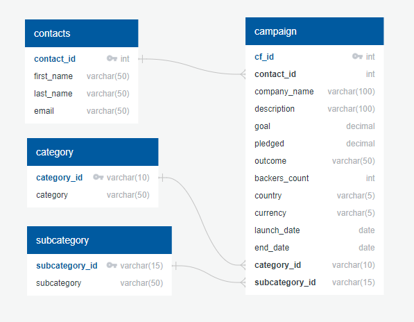

# Crowdfunding-ETL
## Module 13 - Project 2
## Amy Dohlin and Jacque Meyer

-------
## Overview
The goal of Project 2 was to utilize our Python and Pandas skills to build an ETL Pipeline, extract and transform the data, export to CSV files, and use the CSVs to create an ERD/table schema and create a Postgres database. The four main objectives were:
* Create the Category and Subcategory DataFrames
* Create the Campaign DataFrame
* Create the Contacts DataFrame
* Create the Crowdfunding Database

--------
## DataFrames
### Category DF and Subcategory DF
The first task was creating the Category and Subcategory dataframes. We did this by importing and reading the provided CSV file "crowdfunding". Next we parsed the data to find the column names and split the 'category and subcategory' column into two separate columns. This meant we also needed to split the values contained within that column. To accomplish this we used the df.str.split() function, with the parentheses containing ('/', n=1, expand= True) to separate the values based on the / delimiter.

The next step was to find the unique values in both of the category and subcategory columns by applying the .unique() function to each of them. Then we printed the length of the lists (9 unique values in category, 24 unique values in subcategory) to create ID lists: category_id and subcategory_id. The purpose of this was to assign each unique category and subcategory description an ID number and make the data a little easier to work with. The next step in this process was to create a category dataframe and a subcategory dataframe using only their ID numbers and descriptions. Our final step was to export each dataframe to a CSV file to use later in the project.

### Campaign DF
Next, we needed to build the campaign dataframe. This dataframe was initially created by using the .copy method to make a copy of the crowdfunding_info_df. The first step in cleaning this dataframe was to use the .rename method to change the ‘blurb’, ‘launched_at’, and ‘deadline’ columns to ‘description’, ‘launch_date’, and ‘end_date’, respectively. We then needed to change the ‘goal’ and ‘pledged’ data types to float using the .astype() method. The next step was changing the ‘launch_date’ and ‘end_date’ data types to datetime format using pd.to_datetime and dt.strftime. Finally, we merged this dataframe with the category and subcategory dataframes using pd.merge and deleted the unwanted columns with .drop. This data was exported to a CSV file named campaign.csv.

### Contact Info DF
Following the campaign dataframe, we needed to create a dataframe for the contact info. We were provided with an Excel file to import into the notebook, and once we viewed a sample of the data we needed to fix the import process to correctly read the header. This was accomplished by adding header=3 into the pd.read_excel('Resources/contacts.xlsx', header=3).

Furthermore, we noticed the contact info was stored as a JSON dictionary in each cell and would need to be parsed into their own cells as contact_id, name, and email. In order to successfully extract the values we needed to import json from the python library and create empty lists for the keys (col_names) and values (values).

The next step was to iterate through each row of the df using a for loop and the .iterrows() function, and assigning the variable data as row[0]. Next we converted each row into a Python dictionary by using the json.loads() function. Then we used list comprehensions to separate the keys and values into their respective dictionaries by inputting:
  * cols = [k for k,v in converted_data.items()]
  * dict_values = [v for k,v in converted_data.items()]

The last step in the iteration process was to append these to their respective col_names and values lists.

Once we had our lists we converted them into a Pandas df using pd.DataFrame(values, columns= col_names[0]), where the [0] indicates the columns as the header row. Putting the lists into a df allowed us to check the data type for each value and decide whether the data types needed to be adjusted (in this case, they did not). The next step was to separate the first and last names into their own columns. This required us to apply regular expressions to extract what exactly we needed. To accomplish this we used .str.extract() with the following expressions:
  * '(\w+)(?:\s)' for the first names, where it specifies that we want any text up to but not including the white space and subsequent characters;
  * '(?:\s)(\w+)' for the last names, where it specifies that we only want any text after the white space.

This resulted in the first_name and last_name columns, and allowed us to drop the name column. 
The last step was to reorder the columns as contact_id, first_name, last_name, email, and then export the df to a CSV (contacts.csv).

---------
## Database
Our last task was to create a Postgres Database using the four CSV files we previously exported. We started by using QuickDBD to create a schema for the four tables. We then determined our Primary and Foreign keys and connected the tables accordingly. This schema was then exported to a PostgreSQL file. In pgAdmin we created a new database called crowdfunding_db and imported the schema file to create our tables. The next step was to import the tables in the following order: ‘contacts’, ‘category’, ‘subcategory’ and finally ‘campaign’. This allowed for the campaign file, which held the foreign keys, to import properly in relation to the other three tables. Lastly, we checked that all tables were created correctly and had the proper data by running the SELECT * FROM <table_name> command for each table.

### Below are screen shots with descriptions showing our process and outcomes:

\
This is the ERD we created using QuickDBD.

----

\
Here you can see the start of our schema created by exporting the ERD data to PostgreSQL. *Note: The full scheme can be found in our repository: crowdfunding_db_schema.sql*

----

\
We created the database and them ran the schema to create the 4 tables.

----

\
We imported each CSV and used SELECT * FROM <table_name> to view the 4 tables and the corresponding data.

-------
## Summary
* This project helped to reinforce the Extract, Transform, and Load (ETL) pipeline module we worked on the week.
* It also required us to use the SQL knowledge from modules 9 and 10, as well as continuing to gain proficiency in VBS, Python, and Pandas DataFrames.
* Working with another student also let us practice branches and merging in Git Hub.

--------
## References and Sources
